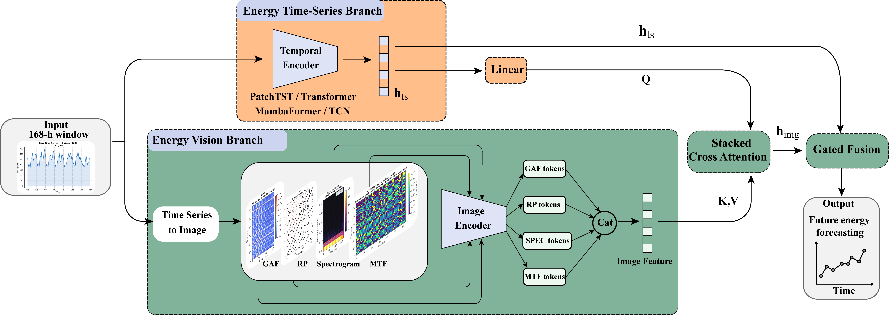

# A Vision-Enhanced Multimodal Framework for Accurate Building Energy Load Forecasting


 


 

## Environment
- The code is tested on Ubuntu 22.04, python 3.10, cuda 12.2.


## Installation
 1. Clone this repository
  ```bash
  git clone https://github.com/kailaisun/mutli-modal-energy-forecast
  ```
  
 2. Install 
  ```bash
  pip install -r requirements.txt
  ```

## Dataset

[BuildingsBench](https://github.com/NatLabRockies/BuildingsBench)

## Train machine learning models


UCL dataset:
```Bash
python load_forecasting_ml.py
```

BDG-2 dataset:
```Bash
python bdg2_ml.py
```

## Train deep learning models

UCL dataset:
```Bash
python deep_forecasting.py
```

BDG-2 dataset:
```Bash
python bdg2_dl.py
```
## Train Multi-modal models

```Bash
python mambaformer_dino_vision.py
```


## Contact Us

If you have other questions❓, please contact us in time 👬


